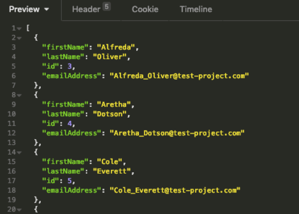
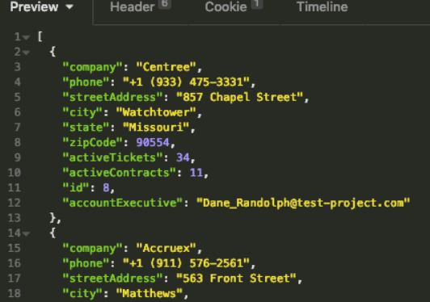
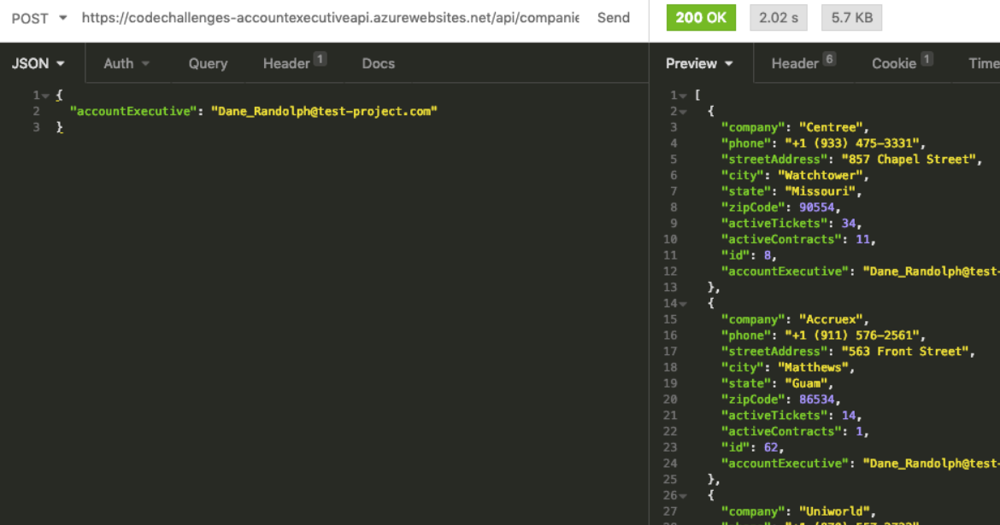

# The Challenge

The challenge is to create a React SPA (using any sort of boilerplate, something like create-react-app is fine) that will hit an endpoint we have set up for you, and return some data. Feel free to use any additional NPM packages to accomplish your goal as you see fit.

## Requirements

- Display a list of "Account Executives" for the user to select from (a select dropdown or something along those lines)
- Data for the dropdown must come from the API provided
- Upon selecting the Account Executive, the list of companies that the Account Executive manages must  be displayed, along with the details of that company
- Data for the company details must come from the API provided
- The following data must be displayed for each Account Executive:
   - Company Name
   - Address
   - Phone
   - Number of Active Tickets (represented by activeTickets)
   - Number of Active Contracts (represented by activeContracts)
- Changing the Account Executive from the dropdown should update the list of companies according to that Account Executive's company list

Note: While we’re not expecting a beautifully rendered front end as this is really just a simple select box loaded w/ data from the API, and on select fill out a simple table or any other method below to display their accounts. Don’t worry about sorting or filtering the results with table controls or pagination or anything. This is more to see how you approach retrieving data from an API and managing the React lifecycle rather than designing a user experience.

## API Endpoints

For these endpoints the data is static but there will be a small randomized delay to simulate a database/API under load with some more processing than is actually occurring.

There is no authorization required, this is completely fake auto-generated information. Let us know if you run into any issues or have questions regarding the API, just send an email to your hiring point of contact any time.

### Users
Returns an array of "user" objects, representing Account Executives.

```
GET: https://codechallenges-accountexecutiveapi.azurewebsites.net/api/users 
```




### Companies
Returns the ENTIRE array of "company" objects .

```
GET: https://codechallenges-accountexecutiveapi.azurewebsites.net/api/companies 
```



### Companies
Returns an array of the company objects where the email matches on the accountExecutive field (case insensitive).

```
POST: https://codechallenges-accountexecutiveapi.azurewebsites.net/api/companies 
```



Sample body above, only need to pass in a json body with a single property, "accountExecutive". This can be retrieved from the /api/users endpoint.

```
{
"accountExecutive": "Dane_Randolph@test-project.com"
}
```

Keep in mind it is possible that you could have 0 company results for an AE, so that doesn’t mean something is broken if a specific Account Executive returns no results.

## Submission

Create a public repo in Github and send us a link to the repo in your GitHub account when you're complete. 

Let us know if you run into any issues or have questions, just send an email to your hiring point of contact any time.